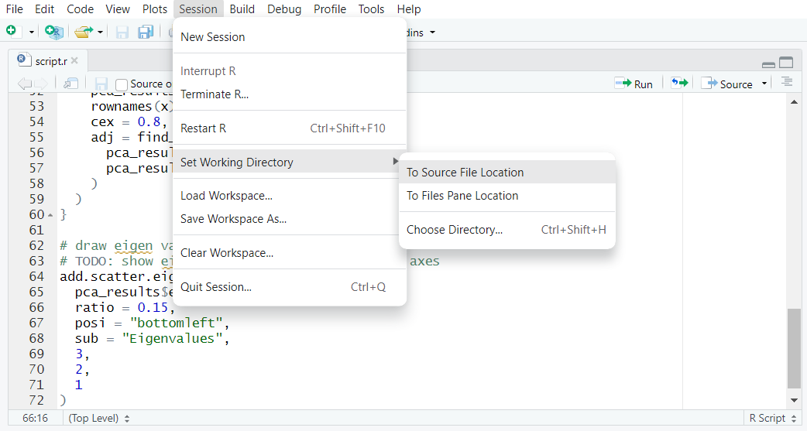
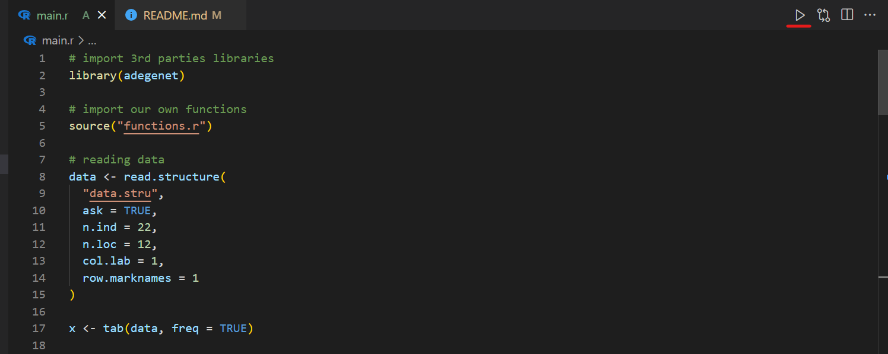

# PCA Analysis Project

# Table of Contents
- [Aim of the project](#aim-of-the-project)
- [How to run the code](#how-to-run-the-code)
    - [RStudio](#rstudio)
    - [Visual Studio Code](#visual-studio-code)
- [Useful Links](#useful-link)
- [About the Author](#about-the-author)
- [Contributors](#contributors)

# Aim of the project
The aim of the project is to plot the results of a pca analysis on a 2 dimensional graph along with the eigen values.

# How to run the code

## RStudio
Open the RStudio IDE and set the working directory to the same location of the `main.r` file. You can do it from the RStudio console with the command `setwd()`

``` r
setwd("path/to/main.r")
```

Alternatively, you can set the working directory from the RStudio GUI



## Visual Studio Code
Open the visual studio code editor and open the folder you saved the repository. If you want to use visual code to run R code, it's highly recommended to install the suggested `R` extensions to have a full visual code experience. To run the code, just click the "play" button on the top right of the window.



# Useful Link
- [R language](https://www.r-project.org/)
- [RStudio IDE](https://posit.co/download/rstudio-desktop/)
- [Visual Studio Code](https://code.visualstudio.com/)


# About the Author
I am Manna Crespan, an awesome researcher. How to get in touch:
- contact 1
- contact 2
- contact 3

# About the Contributors
A special thanks to Massimo Palmisano, who helps developing the code

- [github profile PalMassimo](https://github.com/PalMassimo/)